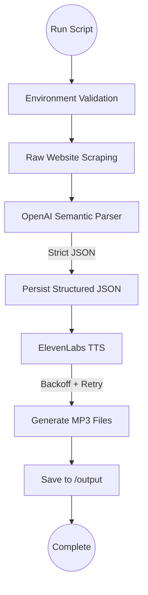

# 🎧 AI Product Audio Summarizer -  Production-Grade Semantic Scraping + OpenAI + ElevenLabs

A backend-focused GenAI pipeline that scrapes **product-style websites**, **semantically extracts structured items using OpenAI**, **generates concise AI summaries**, and converts each **summary into high-quality speech using ElevenLabs**.

Built as a site-agnostic, resilient AI ingestion system with:

Semantic extraction (no CSS selectors)

Strict JSON outputs

Retry + exponential backoff

Clean service-oriented architecture

End-to-end automation (Scrape → Summarize → Audio)

Designed to demonstrate real-world GenAI backend engineering practices.

---

## 🔥 Key Features

### ✅ Semantic Website Scraping (LLM-powered)

 - Fetches raw readable content from any product-style website
   -Avoids brittle CSS selectors entirely
   -Uses OpenAI to understand page content semantically
   -Works even if DOM structure changes
   
### ✅ Structured AI Extraction + Summarization

 - Each item is converted into:
 - Title / identifier
 - Short description
 - AI-generated 1–2 sentence summary
 - Implemented with:
 - OpenAI json_schema
 - strict: true enforcement
 - Deterministic backend-friendly outputs

***This removes the need for defensive parsing.***


### ✅ High-Quality Audio Generation (ElevenLabs)

  - Each summary is converted into speech
  - One .mp3 file per extracted item
  - Automatic retries with exponential backoff
  - Files persisted locally
  - Result: 5 independent audio files per run

### ✅ Production Reliability

  - Environment validation before startup
  - Retry handling for OpenAI + ElevenLabs
  - Exponential backoff on 429 / transient failures
  - Input sanitization to reduce tokens + hallucinations
  - Modular services with single responsibility

### 🌐 Target Website (Scraping Source)

  - For evaluation, the pipeline was tested against:

  - https://quotes.toscrape.com/
  - Although this is a demo site, it behaves like a product listing:
  - Repeated content blocks
  - Public HTML
  - Multiple items per page
  - Each quote is treated as a “product item”.


**The architecture is site-agnostic — replacing this URL requires no scraper logic changes**.

🏗 Architecture
flowchart TD



### Flow Summary

  - Validate API keys
  - Scrape raw readable content
  - Send sanitized text to OpenAI
  - Receive structured summaries (strict JSON)
  - Persist JSON locally
  - Convert summaries to speech via ElevenLabs
  - Save .mp3 files to /output


📁 Project Structure
```
├── src/
│   ├── services/
│   │   ├── scraper.service.js      # Site-agnostic content extraction
│   │   ├── openai.service.js       # Semantic parsing + summaries
│   │   └── elevenlabs.service.js   # Text-to-speech + retry logic
│   ├── utils/
│   │   ├── file-manager.js         # JSON + audio persistence
│   │   └── validate-env.js         # API key validation
│   └── index.js                    # Central orchestrator
│
├── data/                           # Generated structured JSON (gitignored)
├── output/                         # Generated MP3 files (gitignored)
├── .env
└── README.md
```

### Design principle:

Each module owns exactly one responsibility.

No monolithic scripts. Production-style separation.

## ⚙️ Setup Instructions

1️⃣ Prerequisites

  - Node.js v18+
  - OpenAI API Key
  - ElevenLabs API Key

2️⃣ Installation

  git clone <your-repo-link>
  cd <repo-folder>
  npm install axios cheerio openai elevenlabs dotenv

  **Note**: "Ensure you have Node.js v18+ installed." This prevents any environment-related confusion".

3️⃣ Configure Environment

Create .env in project root:

OPENAI_API_KEY=your_openai_key_here

ELEVENLABS_API_KEY=your_elevenlabs_key_here


Startup will fail fast if keys are missing.

### 🚀 Run the Pipeline
node src/index.js


This executes:

- Scraping
- Semantic extraction
- Summarization
- JSON persistence
- Audio generation

### Outputs:

- /data → structured extracted items

- /output → 5 generated .mp3 files

### 🧪 Test Result

Using https://quotes.toscrape.com/:

✅ Extracted 5 items

✅ Generated 1–2 sentence summaries

✅ Persisted structured JSON

✅ Created 5 unique .mp3 audio files

Full end-to-end automation completed successfully.

### 🚀 Proof of Work

## 🚀 Initializing Universal Backend AI Assessment Flow

**🔍 Step 1**: Fetching raw content from https://books.toscrape.com/

**🤖 Step 2 & 3**: AI is extracting and summarizing 5 products

**💾 Step 4**: Saving structured data to local storage

**🎙️   Step 5**: Converting summaries to audio...
   - Processing audio for: A Light in the Attic
   - Processing audio for: Tipping the Velvet
   - Processing audio for: Soumission
   - Processing audio for: Sharp Objects
   - Processing audio for: Sapiens: A Brief History of Humankind

✅ Assessment Complete! 5 audio files generated in /output.

**Audit Note**: The data/products.json file and .mp3 files in /output are excluded from version control to maintain repository cleanliness. To reproduce these results, please follow the Setup instructions.

### 🧠 Senior - Level Design Decisions
### 🔹 Semantic Extraction over CSS Selectors

 - Traditional scrapers break when HTML changes.

**This system**:

 - Extracts readable text

 - Lets OpenAI identify meaningful entities

 - This mirrors modern AI ingestion pipelines used in production.

### 🔹 Strict JSON Contracts

**OpenAI is configured with**:

 - json_schema

 - strict: true

**Guarantees**:

 - Always valid structure

 - No malformed responses

 - Clean downstream processing

### 🔹 Resiliency Layer

 - Both OpenAI and ElevenLabs calls include:

 - Retry logic

 - Exponential backoff

 - Protects against:

 - Rate limits

 - Temporary outages

 - Network instability

### 🔹 Token Optimization

 - Before LLM calls:

 - HTML tags stripped

 - Only meaningful text retained

**Benefits**:

 - Lower cost

 - Faster inference

 - Improved comprehension

### 🔹 Explicit Orchestration

 - index.js contains only flow control, not business logic.

 - This mirrors microservice-style coordination patterns.

### 📊 Alignment With Evaluation Criteria
## ✅ Correctness & Execution Flow

Clear deterministic pipeline:
Scrape → Extract → Summarize → Audio

## ✅ Code Clarity & Structure

 - Service-based layout
 - Single-responsibility modules
 - Clean orchestration

## ✅ Practical Decision Making

  - Semantic scraping
  - Strict structured outputs
  - Retry + backoff
  - Input sanitization

## ✅ Proper OpenAI + ElevenLabs Usage

  - OpenAI for semantic extraction + summarization
  - ElevenLabs strictly for TTS
  - Both wrapped with validation + retries

## ✅ Documentation Quality

  - Setup instructions
  - Architecture
  - Design rationale
  - Test results
  - Engineering decisions

## 📌 Future Improvements

  - Parallel scraping of multiple URLs
  - Batch audio generation
  - Streaming TTS
  - Cloud deployment (Render / EC2)
  - Audio metadata tagging
  - Queue-based processing (BullMQ / Redis)
